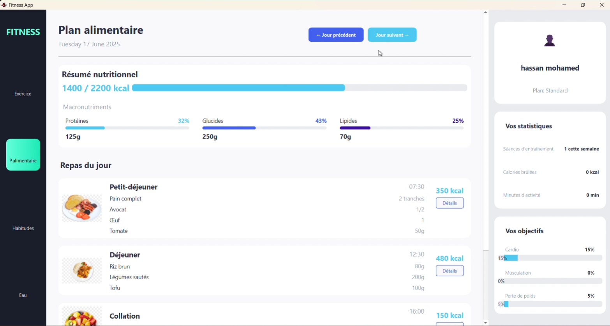

# cpp-qt-fitness
Application C++/Qt pour gérer un programme de remise en forme : plans de musculation, suivi alimentaire, habitudes quotidiennes et hydratation. Accessible après création de compte ou connexion. Interface intuitive pour accompagner les utilisateurs dans leurs objectifs bien-être.
